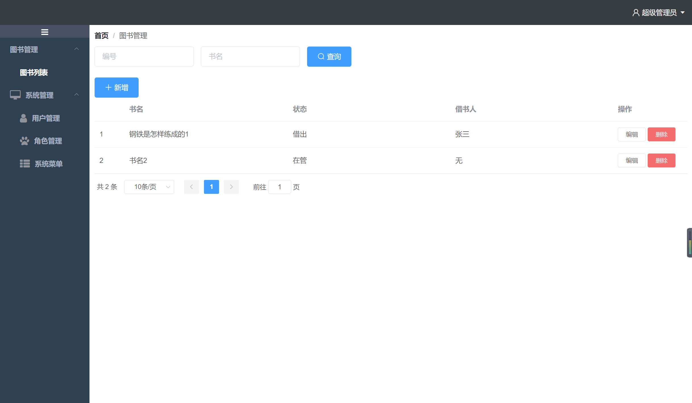

java1.8 node v8.12.0

    
    简单、快速、高效开发脚手架

    
    <a target="_blank" href="https://www.bilibili.com/video/BV1qB4y1M7vP">点击这里查看视频教程-8分钟学完前后分离增删改查</a>

    
    <a target="_blank" href="https://github.com/tanzibiao/mybatis-generator-core">点击这里跳转到代码生成工具-github（国际）</a>

    
    <a target="_blank" href="https://gitee.com/tanzibiao/mybatis-generator-core">点击这里跳转到代码生成工具-gitee（国内）</a>

### 谁合适用

- 个人学习：快速搭建基于springboot+vue的前后分离项目
- 小型管理后台：可以快速进行开发。
- 学生群体：纸上得来终觉浅，绝知此事要躬行，看了再多不如下载一套代码改一改，学一学。
#### 登录账户
用户名：admin
密码：1
#### 截图

